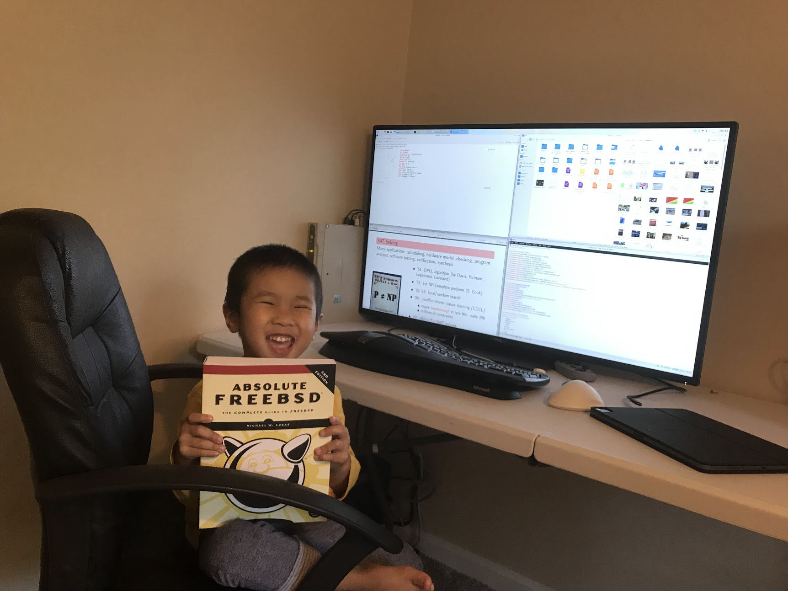

# Running FreeBSD at Home (by ThanhVu Nguyen)


My home machine, which was running Debian and was built in 2007, was
becoming old and running loudly. So, I decided to replace it with a
small **Dell Optiplex** that I got from school. I also installed FreeBSD on it instead of my preferred Debian Linux (because ...
why not? my [lab](https://dynaroars.github.io/) already has two servers
running Debian).

This was the first time that I seriously use FreeBSD (I tried it before
for a couple of weeks and went back to Linux). Below is my experience.

## Timeline

- <2023-08-30 Wed> almost a year ... still use it everyday
- <2023-01-21 Sat\> -- \<2023-02-18 Sat\> ~~`Thunderbird` was updated
    to a version that doesn\'t supported OAuth and it was almost a month
    later that it finally got the new update to fix the issue. Really
    annoying.~~
     *UPDATE: finally it's fixed*


- <2022-10-07 Fri> Things are going strong. Using the machine
  everyday when I am at home.
- <2022-09-14 Wed> Add a Dell Ultrasharp 43\" monitor
- <2022-09-08 Thu> Got the [Asolute
  FreeBSD](https://nostarch.com/absfreebsd3) book -- it has ben a
  while since I bought a computer book
- <2022-09-05 Mon> Setup FreeBSD on Dell Optiplex

## Machine Specs

``` txt
```                        `       tnguyen@ROARS 
  ` `.....---.......--.```   -/    ------------- 
  +o   .--`         /y:`      +.   OS: FreeBSD 13.1-RELEASE-p5 amd64 
   yo`:.            :o      `+-    Uptime: 24 days, 1 hour, 6 mins 
    y/               -/`   -o/     Packages: 1443 (pkg) 
   .-                  ::/sy+:.    Shell: fish 3.6.0 
   /                     `--  /    Resolution: 3840x2160 
  `:                          :`   DE: Plasma 5.26.5 
  `:                          :`   WM: KWin 
   /                          /    Theme: [Plasma], Emacs [GTK2/3] 
   .-                        -.    Icons: [Plasma], breeze [GTK2/3] 
    --                      -.     Terminal: tmux 
     `:`                  `:`      CPU: Intel i7-7700 (8) @ 3.600GHz 
       .--             `--.        GPU: HD Graphics 630 
          .---.....----.           Memory: 20354MiB / 32434MiB 
```

## Installation

Installation was straight-forward by downloading and installing [the
ISO](https://download.freebsd.org/releases/amd64/amd64/ISO-IMAGES/13.1/).
Then for installation I pretty much just accepted all default options. I
believe I unchecked all server capabilities during installation because
this will be used mainly as a desktop, and not a server.

FreeBSD doesn\'t seem to give me an option to install software (e.g., X,
desktop environment, ..). That is fine, I can install them later.

Installation was so quick that I couldn\'t see what was being installed.

## Using

After the first boot I then logged in as root to update the system,
install `X`, `KDE`, `emacs`, and various things. But I didn't really
know to do any of these. So I opened my iPad and read the FreeBSD
manual.

### Installing Things

From the manual, I\'ve learned various new commands for upgrading and
installing software and so

    # updating the system
    freebsd-upgrade fetch
    freebsd-upgrade install

    # updating package
    pkg upgrade

Next is installing and using X, which I encountered some problems. This
is mainly because of me, as I didn\'t even know what graphic card this
computer has other than some integrated one (likely Intel).

    # installing X was easy
    pkg install xorg

Installing X is easy, then I tried `startx`{.verbatim} and it failed
immediately, which is not surprising because I haven't configured any
graphic driver. I then tried the Linux way which is editing `xorg.conf`
file, and I found the FreeBSD manual also has section about doing this.
So I spent half an hr doing this without much success (because the
[manual](https://docs.freebsd.org/en/books/handbook/x11/) says use
`intel` as Driver). It was pretty late and I was so sleepy to debug
and so went to bed.

On the next day, I quickly googled for `FreeBSD, X, Intel`` and found
that the correct dirver is `i915kms` (not `intel`). Moreover, I
shouldn't even have to edit `xorg.con` or any file, everything should
be automatically detected and loaded. Anyway, don't remember all the
details but I think I did something like below

    pkg install drm-kmod


    # /etc/rc.conf
    kld_list="i915kms"
    dbus_enable="YES"  # for KDE

Now `startx` works and so I don\'t need use `root` and so added the
username I created to the `video` group and log in using that username
(I also found out that I cannot `su` to root and then had to also add my
username to `wheel`).

### KDE

Anyway, I then installed KDE, created a simple `~/.xinitrc` file

    exec ck-launch-session startplasma-x11

and `startx` to start KDE.

-   Why KDE? In the past I typically used either
    [WindowMaker](https://www.windowmaker.org/) or
    [Trinity](https://www.trinitydesktop.org/) desktop. I wanted to try
    something new. I probably will switch back to WindowMaker soon, but
    so far I like that the new KDE because it allows me to perform
    natural (invert) mouse scrolling in Firefox (when I was in Linux I
    was never able to get Firefox to do this kind of scrolling with
    Trinity or WindowMaker).

## Other stuff

I was able to install Firefox and Thunderbird and setup my mails. Pretty
straightforward.

### Things that don't work
-   `Brave` browser doesn't support FreeBSD.  Browser choices mainly include `firefox` and `chromium`, which are up to date and run just fine.
-   ~~Sometimes it won't automatically turn off my monitor. Never had
    this problem with the older, smaller monitor~~.
-   Can't get my Canon printer to work. It sees the printer (wireless)
    but Canon does not have the driver for this printer for BSD.
-   ~Slack~ is not available on FreeBSD, so I had to run it inside ~Firefox~.
-   ~~I can't get my monitor to output any sound. The monitor has a
    speaker. And KDE reports that sound driver working fine, but I
    can't hear any sound~~.
    -   got this to work, not sure how though.

## My .dot files

-   `/boot/loader.conf`

``` bash
kern.geom.label.disk_ident.enable="0"
kern.geom.label.gptid.enable="0"
cryptodev_load="YES"
zfs_load="YES"
kern.vty=vt
#snd_hda_load="YES"
snd_driver_load="YES"
```

-   `/etc/rc.conf`

``` bash
hostname="ROARS"
ifconfig_em0="DHCP"
ifconfig_em0_ipv6="inet6 accept_rtadv"
sshd_enable="YES"
# Set dumpdev to "AUTO" to enable crash dumps, "NO" to disable
dumpdev="AUTO"
zfs_enable="YES"
kld_list="i915kms"
dbus_enable="YES"
ntpd_enable="YES"
cupsd_enable="YES"
devfs_system_ruleset="system"
coretemp_load="YES"
sendmail_enable="NONE"
sddm_enable="yes"
```

-   `~/.config/gtk-3.0/settings.ini`

``` txt
[Settings]
gtk-application-prefer-dark-theme=false
gtk-button-images=true
gtk-cursor-theme-name=breeze_cursors
gtk-cursor-theme-size=24
gtk-decoration-layout=icon:minimize,maximize,close
gtk-enable-animations=false
gtk-font-name=Hack,  10
gtk-icon-theme-name=breeze
gtk-key-theme-name=Emacs
gtk-menu-images=true
gtk-modules=colorreload-gtk-module:window-decorations-gtk-module
gtk-primary-button-warps-slider=false
gtk-theme-name=Emacs
gtk-toolbar-style=3
gtk-xft-dpi=98304
```

## Thoughts

I have been using FreeBSD for only three days, during which my son has
already explored and played various KDE games on it. It doesn't feel
much different from my old Debian desktop, though the new machine is
very quiet when compared to my old computer. I was able to start working
and being productive on it right away.
